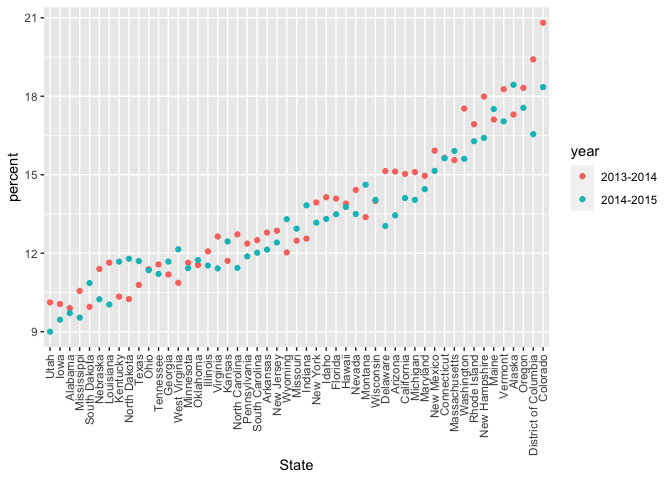

Strings and Factors
================

## String vectors

``` r
string_vec = c("my", "name", "is", "paula")

# whether or not something match
str_detect(string_vec, "m")
```

    ## [1]  TRUE  TRUE FALSE FALSE

``` r
str_detect(string_vec, "paula")  # case sensitive
```

    ## [1] FALSE FALSE FALSE  TRUE

``` r
str_detect(string_vec, "PAULA")
```

    ## [1] FALSE FALSE FALSE FALSE

``` r
# replace
str_replace(string_vec, "paula", "Paula")
```

    ## [1] "my"    "name"  "is"    "Paula"

``` r
string_vec = c(
  "i think we all rule for participating",
  "i think i have been caught",
  "i think this will be quite fun actually",
  "it will be fun, i think"
  )  # "i think" in every element

str_detect(string_vec, "^i think") # ^: at the beginning of the line
```

    ## [1]  TRUE  TRUE  TRUE FALSE

``` r
str_detect(string_vec, "i think$") # $: at the end of the line
```

    ## [1] FALSE FALSE FALSE  TRUE

``` r
string_vec = c(
  "Y'all remember Pres. HW Bush?",
  "I saw a green bush",
  "BBQ and Bushwalking at Molonglo Gorge",
  "BUSH -- LIVE IN CONCERT!!"
  )
str_detect(string_vec, "[Bb]ush")  # Bush or bush both true, BUSH false
```

    ## [1]  TRUE  TRUE  TRUE FALSE

``` r
string_vec = c(
  '7th inning stretch',
  '1st half soon to begin. Texas won the toss.',
  'she is 5 feet 4 inches tall',
  '3AM - cant sleep :('
  )  # look for pattern: number, followed by a letter

str_detect(string_vec, "[0-9][a-zA-Z][a-zA-Z]")  # false for "5 feet"
```

    ## [1]  TRUE  TRUE FALSE  TRUE

``` r
string_vec = c(
  'Its 7:11 in the evening',
  'want to go to 7-11?',
  'my flight is AA711',
  'NetBios: scanning ip 203.167.114.66'
  )
str_detect(string_vec, "7.11")  # . is the free space, "anything" you want it to be
```

    ## [1]  TRUE  TRUE FALSE  TRUE

``` r
string_vec = c(
  'The CI is [2, 5]',
  ':-]',
  ':-[',
  'I found the answer on pages [6-7]'
  )  # we want to find [ and ]
# str_detect(string_vec, "[") # not working!!
str_detect(string_vec, "\\[")  # \\ before special character 
```

    ## [1]  TRUE FALSE  TRUE  TRUE

## Why factors are weird

``` r
factor_vec = factor(c("male", "male", "female", "female"))  # have two levels, put it in alphabetical order

as.numeric(factor_vec)  # male = 2, female = 1
```

    ## [1] 2 2 1 1

``` r
factor_vec = fct_relevel(factor_vec, "male")  # just specify one, R will take it to the front

as.numeric(factor_vec)  # male = 1, female = 2
```

    ## [1] 1 1 2 2

## NSDUH

``` r
nsduh_url = "http://samhda.s3-us-gov-west-1.amazonaws.com/s3fs-public/field-uploads/2k15StateFiles/NSDUHsaeShortTermCHG2015.htm"

table_marj = 
  read_html(nsduh_url) %>% 
  html_table() %>% 
  first() %>%
  slice(-1) #%>% 
  #view  # some untidiness here
```

Let’s clean this up!

``` r
marj_df = 
  table_marj %>% 
  select(-contains("P value")) %>%  # get rid of all columns with "P value"
  pivot_longer(-State, names_to = "age_year", values_to = "percent") %>% 
  separate(age_year, into = c("age", "year"), -11) %>% # form the 11th place to the last, OR use "\\("
  mutate(
    year = str_replace(year, "\\(", ""),
    year = str_replace(year, "\\)", ""),
    percent = str_replace(percent, "[a-c]$", ""),  # letter at the end of the line
    percent = as.numeric(percent)
  ) %>% 
  filter(!(State %in% c("Total U.S.", "Northeast", "Midwest", "South", "West")))
```

Do data frame stuff

``` r
marj_df %>% 
  filter(age == "12-17") %>% 
  mutate(
    State = fct_reorder(State, percent)  # put factor variables in a new order
  ) %>% 
  ggplot(aes(x = State, y = percent, color = year)) +
  geom_point() +
  theme(axis.text.x = element_text(angle = 90, vjust = 0.5, hjust= 1))
```

<!-- -->
